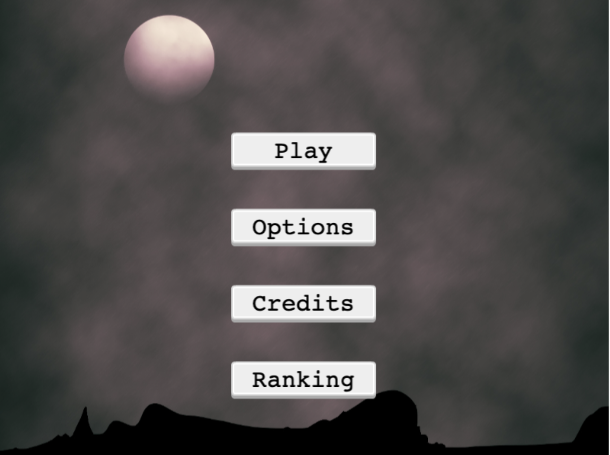

# Platform Game created in Javascript using Phaser framework

This is a game in which you are in control of Slaughter Kind, master of the zombies and you are trying to kill the last humans so you can rule the world. Zombies appeared after some scientists while trying to find the medicine of a virus an explosion occured and lots of people got infected. Many years later most of the humanity has turned into zombies while their goal is to extinct human race. 

## How to Play 

You are trying to go up by stepping upon the platforms. Platforms have humans above them so if you go over them, they die and you earn 10 points in your score. There are 3 stages in this game where platform width changes to smaller as you are going up the ladder. 

- Check [GDD](gdd.md) for more information and screenshots of the game

- Menu Page
 

- Stage 1
  

- Stage 2
  

- Stage 3
  

# FEATURES

- 3 Diffent Stages 
- 3 Different Kind of Platforms
- Background Music

# BUILT WITH

- HTML Canvas
- Javascript
- Webpacker
- Phaser 3

# Live Version

# GETTING STARTED

- `Clone` the project in your local machine
- `cd` into the project directory
- Run `npm install` to install the necessary dependencies
- Run `npm start`, the page will automatically open in a new tab in your browswer. This is in development mode.

### AUTHORS

👤 Marios Kanellopoulos
- Github: [@mariosknl](https://github.com/mariosknl)
- Twitter: [@mariosknl](https://twitter.com/MariosKnl)
- Linkedln: [marios-kanellopoulos](https://www.linkedin.com/in/marios-kanellopoulos)
- Portfolio: [marios-kanellopoulos](https://marioskanellopoulos.com/)

### Acknowledgments
- [Microverse](https://www.microverse.org/)
- [Expedito Inácio de Andrade Neto](https://expjazz.github.io/expedito_andrade/)
- [Phaser3]('https://phaser.io/')
- [Kenney]('https://kenney.nl/') - All the assets can be found here.

### 🤝 Contributing
Contributions, issues and feature requests are welcome! Start by:

- `Forking` the project
- `Cloning` the project to your local machine
- `cd` into the project directory
- Run `git checkout -b your-branch-name`
- Make your contributions
- Push your branch up to your forked repository
- Open a `Pull Request` with a detailed description to the `development branch` of the original project for a review

### Show your support
Give a ⭐️ if you like this project!

### 📝 License
This project is MIT licensed